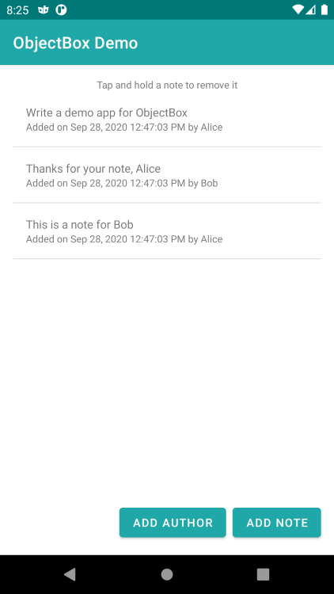

# ObjectBox Kotlin Android App Example

This example note taking app shows how to use ObjectBox in an Android app written in Kotlin.

You can see how to
- write and annotate classes to make them Entities (`Note.kt`, `Author.kt`),
- create a Store and use it throughout the app (`ObjectBox.kt`),
- create, update and put Objects in a Box (`EditNoteActivity.kt`),
- query for Objects (`ObjectBox.kt`) and always display the latest results (`NoteListActivity.kt`).
- create a relation between Entities (`Note.kt`, `Author.kt`),
- use an index to speed up Queries for an Entity property (`Note.kt`).

## Docs links
- [Getting Started with ObjectBox](https://docs.objectbox.io/getting-started)
- [Using ObjectBox with Kotlin](https://docs.objectbox.io/kotlin-support)